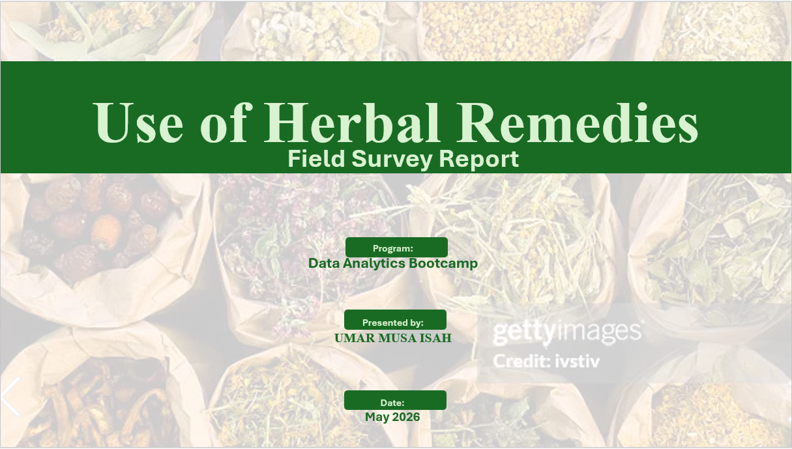

# Herbal Remedies Survey & Data Analytics

### End-to-End Survey Data Analytics, SQL, Excel & Power BI Portfolio Project

<p align="center">
  
</p>

<p align="center">
  <strong>A practical end-to-end data analytics project covering digital data collection, data cleaning, data integration, SQL analysis, Excel analytics, Power BI dashboard development, reporting, documentation, presentation, project management, and portfolio development.</strong>
</p>

<p align="center">


</p>

---

# Project Overview

The **Herbal Remedies Survey & Data Analytics Project** is an end-to-end survey data analytics project developed to assess the use of herbal remedies, understand reasons for their use, examine perceived effectiveness, identify reported side effects, and analyse respondents' recommendation behaviour.

The project demonstrates a complete practical data analytics lifecycle, beginning with multi-platform digital data collection and continuing through data cleaning, preparation, standardisation, validation, data integration, SQL analysis, Microsoft Excel analysis, Power BI dashboard development, technical documentation, final presentation, portfolio development, and GitHub publication.

The project was developed as part of a **Data Analytics Bootcamp** and represents a practical application of data collection, data management, data analysis, data visualisation, reporting, analytical storytelling, project management, and professional portfolio development.

---

# Quick Navigation

- [Project Overview](#project-overview)
- [Business Context](#business-context)
- [Project Objectives](#project-objectives)
- [Project Information](#project-information)
- [Data Collection](#data-collection)
- [Data Cleaning & Preparation](#data-cleaning--preparation)
- [Analytical Dataset](#analytical-dataset)
- [End-to-End Analytics Workflow](#end-to-end-analytics-workflow)
- [Solution Architecture](#solution-architecture)
- [Tools & Technologies](#tools--technologies)
- [SQL Analysis](#sql-analysis)
- [Excel Analysis](#excel-analysis)
- [Power BI Analysis](#power-bi-analysis)
- [Key Findings](#key-findings)
- [Dashboard & Visual Showcase](#dashboard--visual-showcase)
- [Documentation](#documentation)
- [Final Presentation](#final-presentation)
- [Project Management](#project-management)
- [Portfolio Materials](#portfolio-materials)
- [Repository Structure](#repository-structure)
- [Data Quality & Privacy](#data-quality--privacy)
- [Lessons Learned](#lessons-learned)
- [Challenges Encountered](#challenges-encountered)
- [Recommendations](#recommendations)
- [Project Deliverables](#project-deliverables)
- [Skills Demonstrated](#skills-demonstrated)
- [Business Impact](#business-impact)
- [Project Status](#project-status)
- [Author](#author)
- [Portfolio Navigation](#portfolio-navigation)
- [Acknowledgements](#acknowledgements)
- [License](#license)

---

# Business Context

Herbal remedies are widely used within many communities as part of traditional and complementary health practices.

Understanding how people use herbal remedies requires structured data collection and analysis. Important analytical questions include:

- How commonly are herbal remedies used?
- What are the major reasons for their use?
- Which herbal remedies are commonly reported?
- How effective do respondents perceive them to be?
- Are side effects being reported?
- Are herbal remedies combined with hospital medicine?
- Would respondents recommend herbal remedies to others?

This project applies a structured data analytics workflow to survey responses in order to transform collected data into organised analytical information and project-level insights.

The findings describe the surveyed respondents and should not automatically be interpreted as representative of the wider population.

---

# Project Objectives

The project was designed to:

- Identify commonly used herbal remedies.
- Determine the major reasons respondents use herbal remedies.
- Assess respondents' perceived effectiveness of herbal remedies.
- Identify reported side effects.
- Examine whether respondents combine herbal remedies with hospital medicine.
- Assess respondents' willingness to recommend herbal remedies to others.
- Clean and standardise data collected from multiple platforms.
- Integrate multi-source datasets into a consistent analytical structure.
- Apply SQL for database development, validation, exploration, and business-question analysis.
- Perform analytical calculations and visualisation using Microsoft Excel.
- Develop an interactive analytical dashboard using Microsoft Power BI.
- Produce professional technical documentation and reporting materials.
- Develop portfolio-ready project materials.
- Demonstrate an end-to-end practical data analytics workflow.

---

# Project Information

| Item | Details |
|------|---------|
| **Project Title** | Use of Herbal Remedies — Survey & Data Analytics Project |
| **Programme** | Data Analytics Bootcamp |
| **Project Type** | Survey Data Collection, Data Cleaning, Data Analysis, Visualisation & Reporting |
| **Survey Topic** | Use of Herbal Remedies |
| **Project Period** | 23 April 2026 – 7 May 2026 |
| **Total Responses Collected** | 100 |
| **Final Analytical Dataset** | 60 respondents |
| **Collection Platforms** | KoboToolbox, CommCare, Google Forms |
| **Primary Analysis Tools** | SQL Server, Microsoft Excel, Microsoft Power BI |
| **Documentation Tools** | Microsoft Word, Markdown |
| **Presentation Tool** | Microsoft PowerPoint |
| **Repository Platform** | GitHub |
| **Project Status** | Completed — Portfolio Ready |

---

# Data Collection

Survey responses were collected using three digital data-collection platforms:

- **KoboToolbox**
- **CommCare**
- **Google Forms**

The multi-platform approach provided practical experience in managing survey data collected from different digital sources.

## Data Collection Distribution

| Platform | Responses |
|----------|----------:|
| KoboToolbox | 20 |
| CommCare | 20 |
| Google Forms | 60 |
| **Total** | **100** |

The source datasets were subsequently reviewed, cleaned, standardised, validated, and prepared for downstream analytical workflows.

---

# Data Cleaning & Preparation

Data cleaning and preparation were completed before the main analytical stages of the project.

The preparation process included:

- Reviewing source datasets.
- Identifying unnecessary fields.
- Removing personally identifiable information.
- Standardising variable names.
- Standardising categorical values.
- Reviewing missing and inconsistent responses.
- Resolving data-type inconsistencies.
- Harmonising datasets collected from different platforms.
- Creating a consistent analytical structure.
- Validating the cleaned dataset.
- Preparing the final analytical dataset for SQL, Excel, and Power BI.

The cleaned dataset was then used as the foundation for the downstream analytical workflow.

---

# Analytical Dataset

Following data cleaning, standardisation, validation, and preparation, the final analytical dataset used for downstream analysis contained **60 respondents**.

## Core Variables

| Variable | Description |
|----------|-------------|
| `RespondentID` | Unique respondent identifier |
| `Gender` | Respondent gender |
| `AgeGroup` | Respondent age category |
| `Location` | Respondent location |
| `UsesHerbalRemedies` | Whether the respondent uses herbal remedies |
| `HerbsUsed` | Herbal remedies reported by respondents |
| `UsageFrequency` | Frequency of herbal remedy use |
| `ReasonForUse` | Main reason for herbal remedy use |
| `HerbSource` | Source of herbal remedies |
| `IsEffective` | Whether respondents consider herbal remedies effective |
| `EffectivenessLevel` | Perceived level of effectiveness |
| `HasSideEffects` | Whether side effects were reported |
| `CombineWithHospitalMedicine` | Whether herbal remedies are combined with hospital medicine |
| `RecommendToOthers` | Whether respondents recommend herbal remedies to others |

---

# End-to-End Analytics Workflow

The project follows a structured end-to-end data analytics process:

```text
Digital Data Collection
        ↓
Source Data Review
        ↓
Data Cleaning
        ↓
Data Standardisation
        ↓
Data Integration
        ↓
Data Validation
        ↓
SQL Database Development
        ↓
Exploratory Data Analysis
        ↓
Business-Question Analysis
        ↓
Advanced SQL Analysis
        ↓
Excel Analysis & Dashboard
        ↓
Power BI Data Modelling
        ↓
Power BI Dashboard
        ↓
Quality Assurance
        ↓
Technical Documentation
        ↓
Final Presentation
        ↓
Portfolio Development
        ↓
GitHub Publication