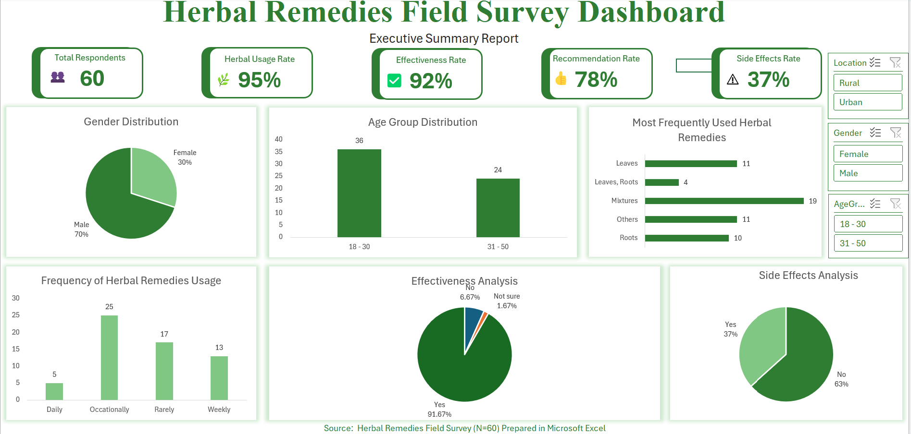
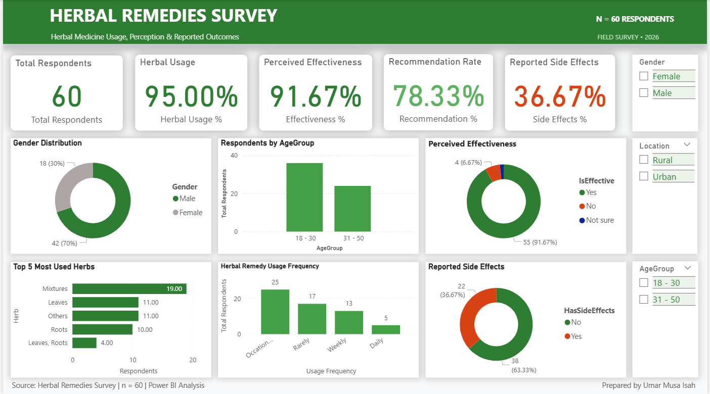
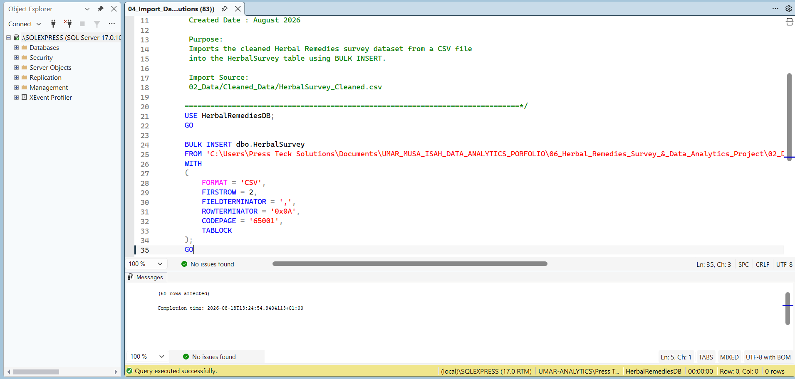
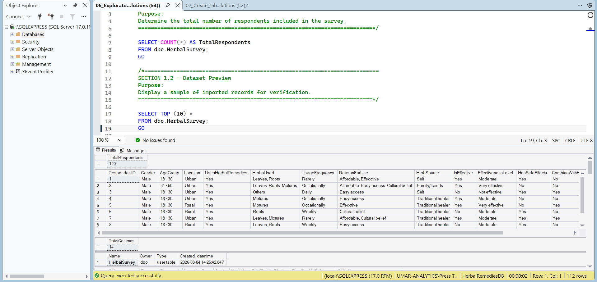
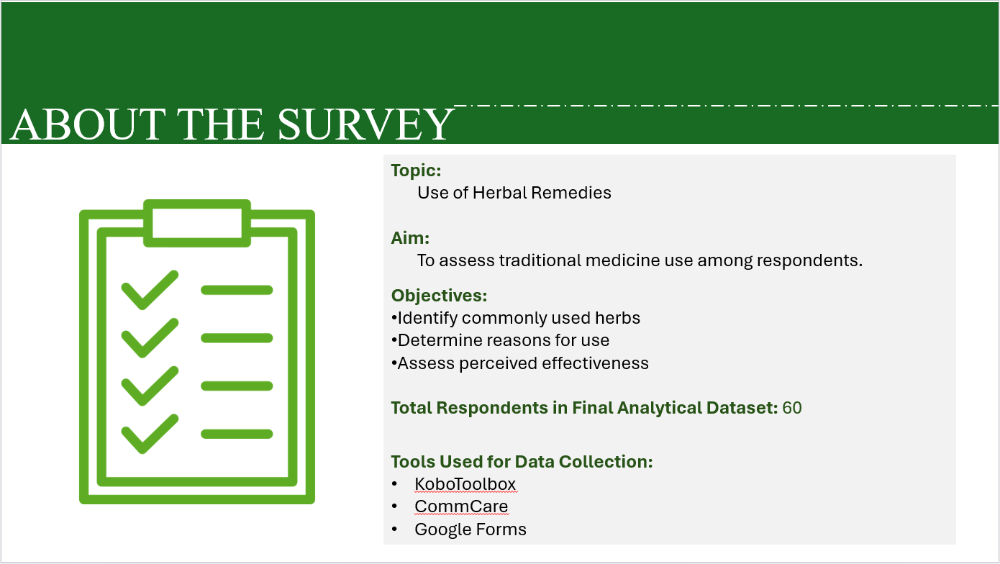

# Herbal Remedies Survey & Data Analytics

### End-to-End Survey Data Analytics Project | Data Collection • Data Cleaning • SQL • Excel • Power BI • Reporting • Portfolio


---

# Project Overview

The **Herbal Remedies Survey & Data Analytics Project** is an end-to-end survey data analytics project developed to assess the use of herbal remedies, understand reasons for their use, examine perceived effectiveness, identify reported side effects, and analyse respondents' recommendation behaviour.

The project demonstrates a complete practical data analytics lifecycle, beginning with multi-platform digital data collection and continuing through data cleaning, preparation, standardisation, validation, data integration, SQL analysis, Microsoft Excel analysis, Power BI dashboard development, technical documentation, professional presentation, portfolio development, and GitHub publication.

The project was developed as part of a **Data Analytics Bootcamp** and represents a practical application of data collection, data management, data analysis, visualisation, reporting, and analytical storytelling skills.

---

# Business Context

Herbal remedies are widely used within many communities as part of traditional and complementary health practices.

However, understanding how people use herbal remedies, why they use them, how effective they perceive them to be, whether they experience side effects, and whether they combine them with hospital medicine requires structured data collection and analysis.

This project applies a practical data analytics workflow to transform survey responses into structured information and analytical insights.

The project is therefore designed not as a clinical study, but as a **survey data analytics case study** demonstrating how raw multi-source survey data can be transformed into validated analytical outputs and decision-support visuals.

---

# Project Information

| Item | Details |
|------|---------|
| **Project Title** | Use of Herbal Remedies — Survey & Data Analytics Project |
| **Program** | Data Analytics Bootcamp |
| **Project Type** | Survey Data Collection, Data Cleaning, Data Analysis, Visualisation & Reporting |
| **Project Period** | 23 April 2026 – 7 May 2026 |
| **Survey Topic** | Use of Herbal Remedies |
| **Total Responses Collected** | 100 |
| **Final Analytical Dataset** | 60 respondents |
| **Data Collection Platforms** | KoboToolbox, CommCare, Google Forms |
| **Primary Analysis Tools** | SQL, Microsoft Excel, Microsoft Power BI |
| **Reporting Tools** | Microsoft Word, Microsoft PowerPoint, Markdown |
| **Repository Platform** | GitHub |
| **Project Status** | Completed — Portfolio Ready |

---

# Project Objectives

The project was designed to:

- Identify commonly used herbal remedies.
- Determine the major reasons respondents use herbal remedies.
- Assess respondents' perceived effectiveness of herbal remedies.
- Identify reported side effects.
- Examine whether respondents combine herbal remedies with hospital medicine.
- Assess respondents' willingness to recommend herbal remedies to others.
- Clean and standardise data collected from multiple platforms.
- Integrate data into a structured analytical dataset.
- Apply SQL for data validation, exploration, and business-question analysis.
- Perform analytical calculations and visualisation using Microsoft Excel.
- Develop an interactive analytical dashboard using Power BI.
- Produce professional technical documentation and reporting materials.
- Develop portfolio-ready project materials.
- Demonstrate an end-to-end practical data analytics workflow.

---

# Project Workflow

The project followed a structured end-to-end analytics lifecycle:

```text
Digital Data Collection
        ↓
Source Data Review
        ↓
Data Cleaning
        ↓
Data Standardisation
        ↓
Data Integration
        ↓
Data Validation
        ↓
SQL Database Development
        ↓
Exploratory Data Analysis
        ↓
Business Questions
        ↓
Advanced SQL Analysis
        ↓
Excel Analysis & Dashboard
        ↓
Power BI Dashboard
        ↓
Quality Assurance
        ↓
Technical Documentation
        ↓
Final Presentation
        ↓
Portfolio Development
        ↓
GitHub Publication
```

---

# Solution Architecture

```text
┌──────────────────────┐
│  Digital Collection  │
├──────────────────────┤
│ KoboToolbox          │
│ CommCare             │
│ Google Forms         │
└──────────┬───────────┘
           │
           ▼
┌──────────────────────┐
│ Source Data Review   │
│ & Cleaning           │
└──────────┬───────────┘
           │
           ▼
┌──────────────────────┐
│ Standardised         │
│ Analytical Dataset   │
└──────────┬───────────┘
           │
     ┌─────┼─────┐
     ▼     ▼     ▼
   SQL   Excel  Power BI
     │     │     │
     └─────┼─────┘
           ▼
┌──────────────────────┐
│ Insights & Reporting │
├──────────────────────┤
│ Documentation        │
│ Presentation         │
│ Portfolio            │
└──────────────────────┘
```

---

# Data Collection

Survey data was collected using three digital data-collection platforms:

- **KoboToolbox**
- **CommCare**
- **Google Forms**

The multi-platform approach provided practical experience in collecting, organising, comparing, and integrating survey responses originating from different digital sources.

## Collection Distribution

| Platform | Responses |
|----------|-----------:|
| KoboToolbox | 20 |
| CommCare | 20 |
| Google Forms | 60 |
| **Total** | **100** |

Following data cleaning, standardisation, validation, and preparation, **60 respondents formed the final analytical dataset** used for the downstream SQL, Excel, and Power BI workflow.

---

# Data Cleaning & Preparation

Data cleaning and preparation were completed before the main analytical stages.

The preparation process included:

- Reviewing source datasets.
- Identifying unnecessary fields.
- Removing personally identifiable information.
- Standardising variable names.
- Standardising categorical values.
- Reviewing missing and inconsistent responses.
- Resolving data-type inconsistencies.
- Harmonising datasets collected from different platforms.
- Creating a consistent analytical structure.
- Validating the cleaned dataset.
- Preparing the final dataset for SQL, Excel, and Power BI.

The cleaned dataset became the foundation of the downstream analytical workflow.

---

# Analytical Dataset

The final analytical dataset contains structured variables representing respondent characteristics, herbal remedy usage, perceptions, and behavioural responses.

| Variable | Description |
|----------|-------------|
| `RespondentID` | Unique respondent identifier |
| `Gender` | Respondent gender |
| `AgeGroup` | Respondent age category |
| `Location` | Respondent location |
| `UsesHerbalRemedies` | Whether the respondent uses herbal remedies |
| `HerbsUsed` | Herbal remedies reported by respondents |
| `UsageFrequency` | Frequency of herbal remedy use |
| `ReasonForUse` | Main reason for herbal remedy use |
| `HerbSource` | Source of herbal remedies |
| `IsEffective` | Whether respondents consider herbal remedies effective |
| `EffectivenessLevel` | Perceived level of effectiveness |
| `HasSideEffects` | Whether side effects were reported |
| `CombineWithHospitalMedicine` | Whether herbal remedies are combined with hospital medicine |
| `RecommendToOthers` | Whether respondents recommend herbal remedies to others |

---

# Tools & Technologies

## Digital Data Collection

### KoboToolbox

Used for digital survey data collection and structured field-data capture.

### CommCare

Used for digital survey data collection and collection of additional survey responses.

### Google Forms

Used for collecting survey responses and supporting the multi-source data collection process.

---

## Data Analysis & Visualisation

### Microsoft Excel

Used for:

- Data cleaning.
- Data preparation.
- Data validation.
- Analytical calculations.
- Chart development.
- Dashboard development.
- Data review.
- Visual reporting.

### SQL Server

Used for:

- Database creation.
- Table creation.
- Constraint definition.
- Data import.
- Data validation.
- Exploratory data analysis.
- Business-question analysis.
- Advanced analysis.

### Microsoft Power BI

Used for:

- Data modelling.
- KPI visualisation.
- Interactive dashboard development.
- Analytical reporting.
- Data visualisation.
- Executive-level presentation.

---

## Documentation & Reporting

### Microsoft Word

Used for project and technical documentation.

### Microsoft PowerPoint

Used for the final analytical presentation.

### Markdown

Used for:

- GitHub README files.
- Technical documentation.
- Portfolio materials.
- Project summaries.
- Case studies.

### JSON

Used for Power BI theme configuration.

### GitHub

Used for:

- Repository management.
- Version control.
- Project publication.
- Portfolio presentation.
- Sharing project deliverables.

---

# SQL Analysis

The SQL component was structured as a complete analytical pipeline:

```text
Create Database
      ↓
Create Table
      ↓
Add Constraints
      ↓
Import Data
      ↓
Validate Data
      ↓
Exploratory Analysis
      ↓
Business Questions
      ↓
Advanced Analysis
```

## SQL Repository Structure

```text
03_SQL/
│
├── 01_Create_Database.sql
├── 02_Create_Table.sql
├── 03_Add_Constraints.sql
├── 04_Import_Data.sql
├── 05_Data_Validation.sql
├── 06_Exploratory_Analysis.sql
├── 07_Business_Questions.sql
├── 08_Advanced_Analysis.sql
└── README.md
```

The SQL workflow demonstrates practical relational database creation, data loading, validation, exploratory analysis, business-question analysis, and advanced analytical querying.

---

# Excel Analysis

Microsoft Excel was used as one of the primary analytical and visualisation tools.

The Excel workflow included:

- Data preparation.
- Data cleaning.
- Data validation.
- Analytical calculations.
- Chart development.
- Dashboard development.
- Supporting visual assets.

## Excel Structure

```text
04_Excel/
│
├── Dashboard/
│   └── dashboard.png
│
├── Images/
│   ├── charts.png
│   ├── cleaned_data.png
│   ├── cover.png
│   └── preview.png
│
└── Herbal_Remedies_Field_Survey_Analysis.xlsx
```

---

# Power BI Analysis

Microsoft Power BI was used to transform the prepared analytical data into an interactive dashboard and reporting environment.

The Power BI component includes:

- Source data.
- PBIX dashboard.
- Dashboard export.
- Custom theme.
- Documentation.
- Dashboard assets.

## Power BI Structure

```text
05_Power_BI/
│
├── 01_Source_Data/
│   └── Herbal_Remedies_Field_Survey_Analysis.xlsx
│
├── 02_PBIX/
│   └── Herbal_Remedies_Survey_Dashboard.pbix
│
├── 03_Export/
│   ├── Herbal_Remedies_Survey_Dashboard.pdf
│   └── preview.png
│
├── 04_Theme/
│   └── Herbal_Remedies_Theme.json
│
├── 05_Documentation/
│   ├── DATA_DICTIONARY.md
│   └── POWERBI_DOCUMENTATION.md
│
└── Assets/
    ├── dashboard_full.png
    └── preview.png
```

---

# Dashboard Showcase

## Excel Dashboard



The Excel dashboard provides a visual summary of the analysed survey data and supports exploratory review of the project's key indicators.

---

## Power BI Executive Dashboard



The Power BI dashboard transforms the final analytical dataset into an interactive reporting environment designed to communicate key survey indicators and patterns.

---

## SQL Analysis



The SQL analysis component demonstrates the structured database and analytical workflow used to validate, explore, and analyse the survey dataset.



---

# Key Findings

The final analytical dataset contains **60 respondents**.

The analysis identified the following key indicators:

| Indicator | Result |
|-----------|-------:|
| Herbal remedy usage | **95%** |
| Perceived effectiveness | **92%** |
| Recommendation rate | **78%** |
| Reported side effects | **37%** |

## Interpretation

The findings indicate widespread herbal remedy use among the surveyed respondents.

A large proportion of respondents reported positive perceptions of herbal remedy effectiveness and indicated willingness to recommend herbal remedies to others.

At the same time, the reported occurrence of side effects highlights the importance of safe-use awareness, appropriate guidance, and further research.

These findings describe the surveyed respondents and should not be interpreted as representative of the wider population without an appropriate representative sampling design.

Perceived effectiveness represents respondents' reported experiences and opinions and should not be interpreted as clinical evidence of medical effectiveness.

---

# Data Visualisation

The project contains visual outputs developed throughout the analytical workflow.

These include:

- Project cover.
- Data collection visual.
- Excel dashboard.
- SQL analysis overview.
- SQL analysis results.
- Power BI executive dashboard.
- Presentation visuals.
- Project preview.

## Visual Assets Structure

```text
08_Images/
│
├── 01_Project_Cover/
│   └── Herbal_Remedies_Survey_Project_Cover.png
│
├── 02_Data_Collection/
│   └── Herbal_Remedies_Field_Data_Collection.png
│
├── 03_Excel_Dashboard/
│   └── Herbal_Remedies_Excel_Dashboard.png
│
├── 04_SQL_Analysis/
│   ├── Herbal_Remedies_SQL_Analysis_Overview.png
│   └── Herbal_Remedies_SQL_Results.png
│
├── 05_PowerBI_Dashboard/
│   └── Herbal_Remedies_PowerBI_Executive_Dashboard.png
│
├── 06_Presentation/
│   ├── Herbal_Remedies_Presentation_Conclusion.png
│   ├── Herbal_Remedies_Presentation_Key_Findings.png
│   └── Herbal_Remedies_Presentation_Overview.png
│
└── 07_Project_Preview/
    └── Herbal_Remedies_Survey_Project_Preview.png
```

---

# Documentation

The project includes dedicated documentation for the major analytical components.

Documentation covers:

- Project report.
- Data dictionary.
- SQL documentation.
- Excel documentation.
- Power BI documentation.
- Project timeline.

## Documentation Structure

```text
06_Documentation/
│
├── 01_Project_Report/
│   ├── 01_Herbal_Remedies_Survey_Project_Report.docx
│   ├── 02_Data_Dictionary.docx
│   ├── 03_SQL_Documentation.docx
│   └── Herbal_Remedies_Project_Timeline.xlsx
│
├── 02_Data_Dictionary/
│   └── Herbal_Remedies_Data_Dictionary.xlsx
│
├── 03_SQL_Documentation/
│   └── Herbal_Remedies_SQL_Documentation.docx
│
├── 04_Excel_Documentation/
│   └── Herbal_Remedies_Excel_Documentation.docx
│
└── 05_PowerBI_Documentation/
    └── Herbal_Remedies_PowerBI_Documentation.docx
```

---

# Final Presentation

The project includes a final professional presentation prepared to communicate the survey project, analytical process, findings, recommendations, challenges, and conclusion.

## Presentation Files

```text
07_Presentation/
│
├── Herbal_Remedies_Survey_Final_Presentation.pptx
└── Herbal_Remedies_Survey_Final_Presentation.pdf
```

### Presentation Preview



---

# Project Management

The project management component documents the planning, organisation, execution, and tracking of the project throughout its lifecycle.

The complete project-management materials are available under:

```text
01_Project_Management/
```

This component supports traceability between project planning, execution, analytical activities, quality assurance, and final publication.

---

# Portfolio Materials

The project includes a dedicated portfolio layer designed to communicate the work professionally to recruiters, clients, collaborators, and other stakeholders.

The portfolio materials cover:

- Project overview.
- Case study.
- Key findings.
- Dashboard showcase.
- Technical summary.
- Portfolio README.

## Portfolio Structure

```text
09_Portfolio/
│
├── 01_Project_Overview/
│   └── Herbal_Remedies_Survey_Project_Overview.md
│
├── 02_Case_Study/
│   └── Herbal_Remedies_Survey_Case_Study.md
│
├── 03_Key_Findings/
│   └── Herbal_Remedies_Survey_Key_Findings.md
│
├── 04_Dashboard_Showcase/
│   └── Herbal_Remedies_Survey_Dashboard_Showcase.md
│
├── 05_Technical_Summary/
│   └── Herbal_Remedies_Survey_Technical_Summary.md
│
└── 06_Portfolio_Readme/
    └── Herbal_Remedies_Survey_Portfolio_README.md
```

---

# Repository Structure

```text
Herbal-Remedies-Survey-Data-Analytics/
│
├── 01_Project_Management/
│
├── 02_Data/
│   ├── data_cleaned/
│   │   └── HerbalSurvey_Cleaned.xlsx
│   │
│   └── raw_data/
│       ├── Commcare_Data.xlsx
│       ├── Google_Data.csv
│       └── KoboToolBox_Data.xlsx
│
├── 03_SQL/
│   ├── 01_Create_Database.sql
│   ├── 02_Create_Table.sql
│   ├── 03_Add_Constraints.sql
│   ├── 04_Import_Data.sql
│   ├── 05_Data_Validation.sql
│   ├── 06_Exploratory_Analysis.sql
│   ├── 07_Business_Questions.sql
│   ├── 08_Advanced_Analysis.sql
│   └── README.md
│
├── 04_Excel/
│   ├── Dashboard/
│   │   └── dashboard.png
│   │
│   ├── Images/
│   │   ├── charts.png
│   │   ├── cleaned_data.png
│   │   ├── cover.png
│   │   └── preview.png
│   │
│   └── Herbal_Remedies_Field_Survey_Analysis.xlsx
│
├── 05_Power_BI/
│   ├── 01_Source_Data/
│   ├── 02_PBIX/
│   ├── 03_Export/
│   ├── 04_Theme/
│   ├── 05_Documentation/
│   └── Assets/
│
├── 06_Documentation/
│   ├── 01_Project_Report/
│   ├── 02_Data_Dictionary/
│   ├── 03_SQL_Documentation/
│   ├── 04_Excel_Documentation/
│   └── 05_PowerBI_Documentation/
│
├── 07_Presentation/
│   ├── Herbal_Remedies_Survey_Final_Presentation.pptx
│   └── Herbal_Remedies_Survey_Final_Presentation.pdf
│
├── 08_Images/
│   ├── 01_Project_Cover/
│   ├── 02_Data_Collection/
│   ├── 03_Excel_Dashboard/
│   ├── 04_SQL_Analysis/
│   ├── 05_PowerBI_Dashboard/
│   ├── 06_Presentation/
│   └── 07_Project_Preview/
│
├── 09_Portfolio/
│   ├── 01_Project_Overview/
│   ├── 02_Case_Study/
│   ├── 03_Key_Findings/
│   ├── 04_Dashboard_Showcase/
│   ├── 05_Technical_Summary/
│   └── 06_Portfolio_Readme/
│
├── .gitignore
└── README.md
```

---

# Data Quality & Privacy

Data quality was treated as a core part of the project lifecycle.

The cleaning and preparation process included:

- Removal of unnecessary personal identifiers.
- Standardisation of variables.
- Review of data consistency.
- Validation of analytical fields.
- Preparation of a structured analytical dataset.
- Quality checks before downstream analysis.

The final project materials were reviewed before public repository publication.

The publication audit covered:

- Personally identifiable information (PII).
- Passwords.
- API keys.
- Credentials.
- Authentication information.
- Unnecessary sensitive information.

**No known PII is included in the final project materials prepared for this repository.**

---

# Lessons Learned

The project provided practical experience in:

- Digital data collection.
- Multi-platform survey management.
- Respondent communication.
- Data organisation.
- Data cleaning.
- Data standardisation.
- Data validation.
- Multi-source data integration.
- SQL database development.
- Exploratory data analysis.
- Business-question analysis.
- Excel dashboard development.
- Power BI dashboard development.
- Analytical storytelling.
- Professional reporting.
- Technical documentation.
- Portfolio development.

---

# Challenges Encountered

Several practical challenges were encountered during the project, including:

- Some respondents were unwilling to participate.
- Limited time for data collection.
- Internet and network problems during submission.
- Incomplete or incorrect responses.
- Difficulty reaching some target respondents.
- Data consistency challenges across multiple collection platforms.
- Data cleaning and validation requirements.

These challenges provided practical experience in field-data management, data quality assurance, and analytical preparation.

---

# Recommendations

Based on the survey findings and project observations, the project recommends:

- Increase awareness of the safe use of herbal remedies.
- Encourage informed decision-making when using herbal remedies.
- Encourage consultation with qualified health professionals where appropriate.
- Improve awareness of potential side effects.
- Promote proper regulation and quality control of herbal products.
- Improve access to reliable healthcare information.
- Conduct additional research using larger and more representative samples.
- Support evidence-based public health education around traditional medicine practices.

---

# Project Deliverables

The completed project contains:

- Source survey datasets.
- Cleaned analytical dataset.
- SQL database scripts.
- SQL validation scripts.
- SQL exploratory analysis.
- SQL business-question analysis.
- Advanced SQL analysis.
- Excel analytical workbook.
- Excel dashboard.
- Excel visualisation assets.
- Power BI dashboard.
- Power BI theme.
- Power BI export.
- Power BI documentation.
- Data dictionary.
- Project report.
- Project timeline.
- Final PowerPoint presentation.
- Final PDF presentation.
- Project image assets.
- Portfolio case-study materials.
- Technical summary.
- Dashboard showcase.

---

# Skills Demonstrated

This project demonstrates practical capability in:

- End-to-End Data Analytics
- Digital Data Collection
- Survey Data Management
- Data Cleaning
- Data Preparation
- Data Standardisation
- Data Integration
- Data Validation
- SQL Database Development
- SQL Exploratory Data Analysis
- Business-Question Analysis
- Advanced SQL Analysis
- Microsoft Excel
- Excel Dashboard Development
- Microsoft Power BI
- Power BI Dashboard Development
- Data Visualisation
- Analytical Storytelling
- Technical Documentation
- Professional Reporting
- Project Management
- Portfolio Development
- GitHub Repository Management

---

# Business Impact

This project demonstrates how structured digital data collection, data-quality processes, relational database analysis, spreadsheet analytics, and business intelligence tools can transform raw survey responses into meaningful analytical outputs.

The workflow provides a practical example of how an analyst can move from:

```text
Raw Survey Responses
        ↓
Structured Dataset
        ↓
Validated Data
        ↓
Analytical Queries
        ↓
Dashboards
        ↓
Insights
        ↓
Recommendations
        ↓
Decision-Support Reporting
```

The project therefore demonstrates not only technical tool usage, but also the ability to connect **data → analysis → visualisation → insight → communication**.

---

# Project Status

## Completed — Portfolio Ready

The project has completed:

- Data collection.
- Data preparation.
- Data cleaning.
- Data standardisation.
- Data integration.
- Data validation.
- SQL database development.
- SQL analysis.
- Exploratory analysis.
- Business-question analysis.
- Advanced analysis.
- Excel analysis.
- Excel dashboard development.
- Power BI dashboard development.
- Quality assurance.
- Technical documentation.
- Final presentation.
- Image asset preparation.
- Portfolio development.
- Repository preparation.
- GitHub publication.

---

# Important Note

The findings presented in this project are based on the surveyed dataset and describe the responses captured within the project.

The results should not be interpreted as population-level estimates unless supported by an appropriate representative sampling design.

Perceived effectiveness represents respondents' reported experiences and opinions and should not be interpreted as clinical evidence of medical effectiveness.

This project is intended for:

- Data analytics demonstration.
- Portfolio development.
- Educational purposes.
- Analytical workflow documentation.
- Professional skills demonstration.

---

# Author

## Umar Musa Isah

**Data Analyst | Monitoring & Evaluation (M&E) Specialist | Dashboard & Reporting Professional**

GitHub: [UmarMusaIsah](https://github.com/UmarMusaIsah)

---

# Portfolio Navigation

This project forms part of a broader Data Analytics portfolio covering practical work in:

- Data Analytics
- Monitoring & Evaluation
- SQL
- Microsoft Excel
- Power BI
- Survey Data Management
- Dashboard Development
- Technical Reporting

Explore the author's GitHub profile for additional analytics projects and professional work.

---

# Acknowledgements

This project was completed as part of a **Data Analytics Bootcamp Capstone Project** and showcases practical application of digital data collection, data management, data analytics, SQL analysis, dashboard development, visualisation, technical documentation, and evidence-based reporting.

---

# License

No open-source license has been applied to this repository.

The repository is published as a **portfolio and project demonstration**.

Unless otherwise stated, the project materials remain the property of the project author.

Commercial reuse, redistribution, reproduction, or modification of the project materials should not be assumed to be permitted solely because the repository is publicly accessible.

---
 
> **Turning survey data into structured insights, meaningful visualisations, and evidence-informed decisions.**